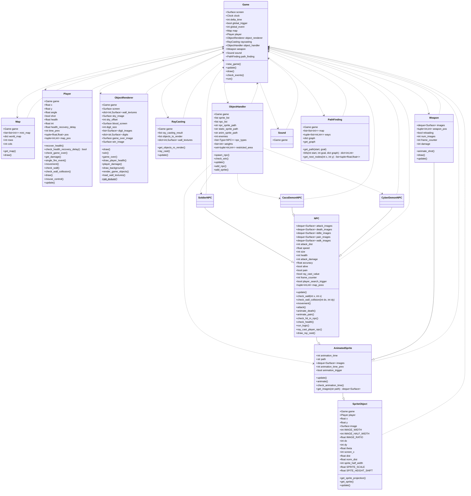
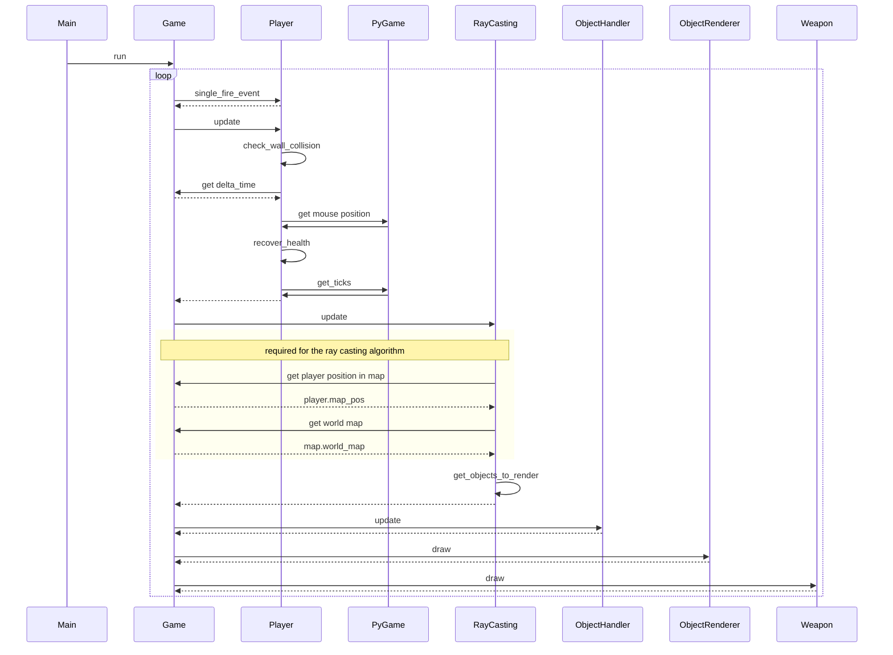

# DOOM-style-Game-refactor

A few weeks ago, I saw [a great tutorial on game development on youtube](https://www.youtube.com/watch?v=ECqUrT7IdqQ). The tutorial shows how to create a DOOM-stlye 3D game in Python from scratch. The guy did a great job at explianing some of the basic ideas of 3D games and I truly appreciate his work. Howeve, I also noticed that the coding practices used through out the codebase are not what I consider to be best practices, so I decided to make a refactor to illustrate how I think the codebase could be improved for better maintainability.

I will try to show the impact of several design choices made on the overal maitainability of the project, as if it was a real life software project. Hopefully, the process shown in this post will help you improve the effectiveness of your own team, by having a codebase that is easier to maintain.

## Understanding the Codebase
Before we start making changes, we need to make sure we understand the impact of the changes we are making. Achieving a perfect understanding of a big codebase is not an easy task, but thankfully ours is not too big; when it becomes to big, try to find isolated pieces on which you can start to contribute.

Understanding a codebase means being able to say:
1. What functions and classes depend on each other. 
2. What messages are being sent from one place to the codebase to the other, as well as when those messages are sent.

In otherwords, you need to know the interaction between all objects and functions in the codebase. To figure out and comunicate the dependencies, we can make a class diagram, for [the original implementation](./original/), we endup with the following:

The class definitions not shown in the diagram are not defined in the game's codebase, but imported from `pygame` or from the standard library. Inherited proerties and methods are not shown either, as it is understood that all children classes have at least all properties of their parent class.

From this diagram, we notice that there is kind of a *main* class which is `Game` that imports most of the other classes and makes them interact, but those other classes also depend on `Game`. From this, you already know what places of the codebase you need to look into, if you are making a change in other places.

To help you understand how objects and functions interact, you can use sequence diagrams:

By using these two diagrams as a reference, we can start to question how relevant a particular function or class definition is and how it affects the overall functionality of our application. 

**A note on diagrams:** in the past, people use to make these kind of diagrams before starting to code anything, but the software engineering community has deprecated this practice, as it is hard to figure out everything in advance and people would endup having out of date diagrams; I recommend them as a tool mostly to communicate and understand what is already there.

**A note on documentation:** we find no docstrings in the codebase, likely because the author made a tutorial and that was his intention. In real life you can find yourself dealing with poorly documented code a lot of the times. One of the first great contributions you can make to the codebase is actually documenting it, it helps you make sure you understand the impact of a particular function and you can validate such newly added documentation with your colleages.

Now that we have got an understanding of the codebase, we can start improving it one step at the time. It is ok if the entire codebase is not understood before an *attempt* to refactor, it is very likely that the attempt will give you more information about it.

## Use most common conventions
There are tools that will give you an initial overview of the most common bad practices used in the codebase. In particular, let's use `flake8` for this job. The fact that I want to use `flake8` just means that I am familiar with it, but it doesn't necessarily mean that I think it is better at pointing bad practices. It is very likely that any tool will give you more or less the same results and will let you ignore any convention that you want to consciously ignore.

When you run `flake8 original`, you will se a huge list of errors, you can summarize them as *lines being too long* and *use of start (`*`) imports*. The first one makes it hard to read code in small screens, while the second makes it hard to keep track of where some objects are comming from. The second is particularly important when you are refactoring code, because you need to be able to quickly find when some objects are defined.

While I do not think that addressing such erros makes a big difference on the overall maintainability of the codebase, I do think it is a good easy first step, so let's do it. The more you can get for free the better, so I used `isort` and `black` to do some of the work automatically; this kind of tools also help you to reduce the amount of debate you have with your colleages about the likes and dislikes, simply follow the tool and people don't have to worry.

 You can see the end result in the [version one folder](./v1/). Now do `flake8 v1` to see that we do not have any issues. 

## Separate the Public from the Private

## Add Type Annotations

## Make Code Testeable

## Depend Only on What is Used

## Make Sure There is Only One Reason to Change an Implementation